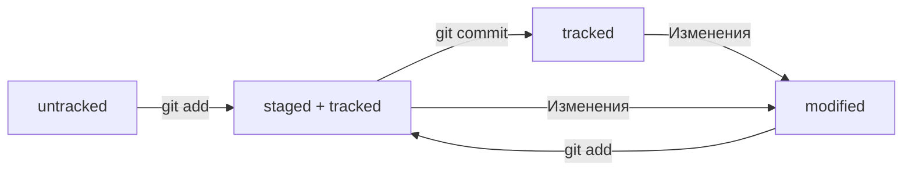

# Методичка по работе с Git

---

## Начнем

---

Инициализируем репозиторий

```bash
$ cd ~/dev/first-project # перешли в нужную папку
$ git init # создали репозиторий
```

Если что-то пошло не так - "разгитить" папку можно так

```bash
$ cd ~/dev/first-project # перешли в нужную папку
$ rm -rf .git # удалили подпапку .git 
```

Проверить состояние репозитория - **git status**

Подготовить файлы к сохранению - **git add**  
Добавить можно файлы по очереди или все с помощью 
'*--all*' или '*.*'

Выполнить коммит - **git commit -m 'Мой первый коммит!**

Сначала команда *git add* сообщает **Git**, 
какие именно файлы нужно сохранить и какую их версию. 
Затем с помощью команды *git commit* происходит само 
сохранение.

Посмотреть историю коммитов - **git log**

## Знакомство с **GitHUB**

---

**GitHub** - платформа для хранения IT-проектов и 
совместной работы над ними с использованием Git. 
По сути, это сайт, куда можно загрузить файлы своего 
проекта для обмена с другими людьми.

Создать удаленный репозиторий можно во вкладке 
*Repositories* в вашем профиле.

Но, чтобы упростить и обезопасить вашу работу с *GitHub* 
научимся генерировать **SSH-ключи**.

```bash
$ cd ~ # перешли в домашнюю директорию
$ ls -la .ssh/ # вывели список созданных ключей
# используем уже готовый или создаем новый
$ ssh-keygen -t ed25519 -C "электронная почта, к которой привязан ваш аккаунт на GitHub"
или
$ ssh-keygen -t rsa -b 4096 -C "электронная почта, к которой привязан ваш аккаунт на GitHub"
$ ls -a ~/.ssh # проверка, что ключи действительно сгенерировались
```

Теперь скопируем содержимое файла с расширение *.pub* и 
вставим в ваш **GitHub:** *Настройки/SSH and GPG keys/New SSH key*

Проверка

```bash
$ ssh -T git@github.com
```

## Связываем локальный и удаленный репозиторий

---

```bash
$ cd ~/dev/first-project
$ git remote add origin git@github.com:%ИМЯ_АККАУНТА%/first-project.git
```

Убедитесь, что репозитории связаны - **git remote -v**

## Синхронизируем локальный и удаленный репозиторий

---

Отправить изменения на удаленный репозиторий - **git push**

В первый раз команду нужно вызвать следующим образом:

```bash
$ git push -u origin main # Если команда приведёт к ошибке, попробуйте 
                          # заменить main на master.
```

## Создание файла README.md

---

Чтобы другие пользователи, а также потенциальные клиенты 
или работодатели могли понять, что представляет собой 
проект, его нужно описать. Такое описание принято 
указывать в файле *README.md* 
(от англ. read - «прочитай» и me - «меня»).

Для того, чтобы залить не просто текст, а выделить его - 
используй язык разметки **Mardown**. Загляните в 
руководства по нему [Шпаргалка на GitHub](https://gist.github.com/fomvasss/8dd8cd7f88c67a4e3727f9d39224a84c) 
или [в этот гайд](https://www.markdownguide.org/cheat-sheet/).

## Хэш - иднтификатор коммита

---

1. Git преобразует информацию о коммитах с помощью алгоритма SHA-1 и для каждого из них рассчитывает уникальный идентификатор — *хеш*.
2. **Хеш** - основной идентификатор коммита и позволяет узнать его автора, дату и содержимое закоммиченных файлов.
3. Все хеши, а также таблицу соответствий *хеш → информация* о коммите Git хранит в папке *.git*.

## Исследуем лог

---

Разберём элементы, из которых состоит описание:  
* строка из цифр и латинских букв после слова commit - это *хеш коммита*;
* **Author** - имя автора и его электронная почта;
* **Date** - дата и время создания коммита;
* в конце находится сообщение коммита.

Получить сокращенный лог - **git log --oneline**

## HEAD - всему голова

---

Файл **HEAD** (англ. «голова», «головной») - 
один из служебных файлов папки .git. Он указывает на коммит, 
который сделан последним (то есть на самый новый).

Вместо *хеша последнего коммита* можно просто написать слово **HEAD** - 
Git поймет, что вы имели ввиду последний коммит.

## Статусы файлов в Git

---

* Статусом *untracked* помечается файл, о существовании которого Git 
знает, но не следит за изменениями в нём. Этот статус - 
противоположность *tracked*, в который попадают все файлы, 
отслеживаемые Git.
* Файл переходит в статус *staged* (англ. "подготовленный") после выполнения *git add*.
* Статус *modified* (англ. "измененный") означает, что файл был изменён.
* Большинство файлов в проектах «шагает» по следующему циклу: 
«изменён» → «добавлен в список на коммит» → «закоммичен» → «изменён» → 
и так далее.

Жизнь файла в **Git**  
(Сделано с помощью [Mermaid](https://mermaid.js.org/intro/))



Как читать - **git status**

* Команда *git status* всегда подскажет, что происходит с файлом: 
например, он добавлен в список «на коммит» или ещё вообще не 
отслеживается, или изменён.
* *git status* показывает явно следующие состояния файлов: *untracked*, 
*staged* и *modified*.
* *git status* подсказывает, какие команды можно выполнить, 
чтобы поменять состояние файла.

## Оформление сообщений к коммитам

---

Есть много правил, но вот основные:  
* Для сообщений на **русском языке** часто рекомендуют использовать 
инфинитивы. Например: *Добавить тесты для PipkaService*, 
*Исправить ошибку #123* и так далее.
*Для сообщений на **английском** рекомендуется использовать 
повелительное наклонение (англ. imperative). Например: 
*Use library mega_lib_300*, *Fix exit button* и так далее.

Эти рекомендации сложились исторически, и им следуют многие проекты.  
Так же нужно помнить, что коммит должен быть емким и информативным.